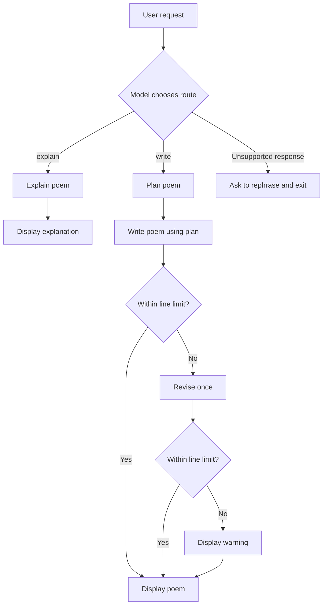

# Poem CLI

A simple LangChain console app using Typer, Rich, and local Ollama `gemma2:9b`.

Requires Python 3.14+, uv, and Ollama running locally.

```bash
uv sync
ollama pull gemma2:9b
```

Write or explain a poem:

```bash
uv run main.py --request "Write a poem about the sea" --lines 4
uv run main.py --request "Explain this poem: Moonlight rests upon the sea."
uv run main.py --help
```

The model classifies your request as `write` or `explain`, and Python selects
the matching workflow. The selected route is shown in the terminal.



- **Write:** Plan → Write → Count nonempty lines → Revise once if needed → Check again.
  If the revised poem still exceeds the limit, display a warning and the poem.
- **Explain:** Explain the supplied poem's meaning, mood, and imagery.
  Include the poem in your request; previous runs are not remembered.

Rich displays loading spinners and panels for the plan, poem, or explanation.
If the router returns an unsupported response, the app asks you to rephrase and exits.

`--request` is required for writing or explaining, but not for subcommands;
`--topic` is an alias. `--lines` defaults to 5, must be
at least 1, and applies only to writing.

Prompt templates are in `prompts.py`; the workflow is in `main.py`.

## Import and search poems

```bash
ollama pull embeddinggemma
uv run main.py ingest ./poems/
uv run main.py search "winter"
uv run main.py search "winter" --limit 4 --max-distance 0.8
```

Search displays embedding distances: lower means closer, not a confidence
percentage. Without `--max-distance`, search returns the nearest `--limit`
poems (default 3), even if some are weak matches. With a cutoff, it returns
only candidates whose distance is at or below that value, possibly none.
The example cutoff `0.8` is illustrative, not calibrated: inspect distances
for several queries before choosing a value for your library and model.

## Save generated poems and use references

```bash
uv run main.py --request "Write a poem about winter" --lines 4 --save
uv run main.py search "winter"
uv run main.py --request "Write a poem about winter" --lines 4 --rag --save
uv run main.py --request "Write a poem about winter" --rag --reference-limit 2 --max-distance 0.8
```

`--save` embeds and stores the final poem after any revision, with its original
request, generation model, timestamp, line limit, and validation status. Exact
duplicate text reuses the existing record. A save failure leaves the poem visible
and exits with an error. A poem still exceeding the limit is saved with that status.

`--rag` retrieves references before planning and writing, displaying their sources
and distances. An empty result falls back to writing without references. By default
the nearest three poems are used; choose a calibrated `--max-distance` to exclude
weak matches. Retrieved text is provided as optional inspiration, not instructions.
These flags apply only to writing; explanations are not saved. Without either flag,
writing and explanation do not access Chroma. RAG and saving require the local
`embeddinggemma` model as well as `gemma2:9b`.
